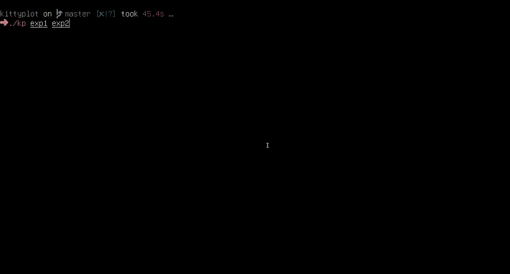

# kittyplot



kittyplot provides a repl to interactively plot graphs at full resolution in the terminal using kitty's [terminal graphics protocol](https://sw.kovidgoyal.net/kitty/graphics-protocol/). 

# Features
* Full-resolution plots in the terminal
* Works over SSH
* Works inside tmux (kind of)
* Single script to modify to suit your needs

# Installation

kittyplot is structued as a single python script `kp` you can throw in your `$PATH` on any machine.

## Requirements

* prompt_toolkit
    * To install, run `pip install prompt_toolkit`
* the [kitty terminal](https://sw.kovidgoyal.net/kitty/)
    * Installation instructions can be found [here](https://sw.kovidgoyal.net/kitty/binary/)
* Kitty's `kitten` binary on the machine containing data to be plotted
    * For local installation, kitten should be installed alongside kitty
    * For remote installation, copy the `kitten` binary from your local kitty install to your `$PATH` on remote.

# Usage

kittyplot is heavily inspired by [tensorboard](https://www.tensorflow.org/tensorboard) and is designed primarily to visualize data from multiple experiments. To remove the need to enter the names of runs or the paths to data, we make the following assumptions:

* We assume all experiments follow the same directory structure, and thus store their results in the same path.
* We assume the root directory of the experiment contains the name of the experiment for the plot legends
* Each metric to be tracked is a separate column in the csv, and each line of the csv contains new values for each of the metrics.

For example, if your experiments are structures as follows

```
experiments/
|-experiment-1/
| |- checkpoint-1.p
| |- checkpoint-2.p
| |- results.csv
|-experiment-2/
| |- checkpoint-1.p
| |- checkpoint-2.p
| |- results.csv
```

Then inside `experiments/` you would run `kp experiment-1 experiment-2`.

## REPL

Once your experiment data is loaded, you are presented with a repl. You can enter a regex into the repl; any columns that match the regex will be plotted, one subplot per colum with a new line per experiment.

## Min, Mean, Stdev, and Max

If a column has a name like "reward_mean", kittyplot will look for columns "reward_min", "reward_max" and "reward_std". If these columns are found, kittyplot will display a view of the standard deviation and the range of values in a single plot called "reward".
